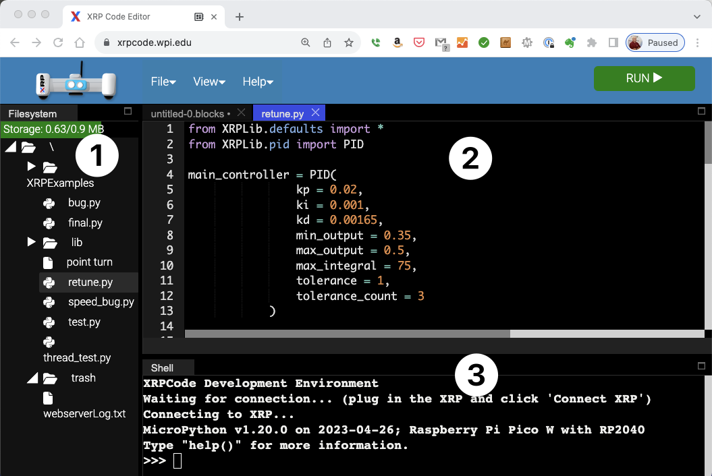
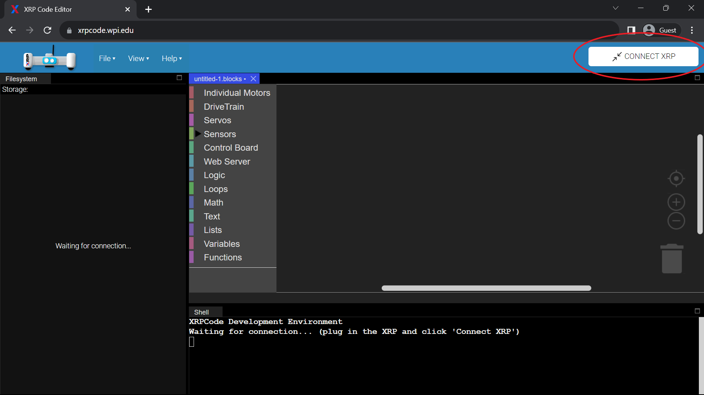
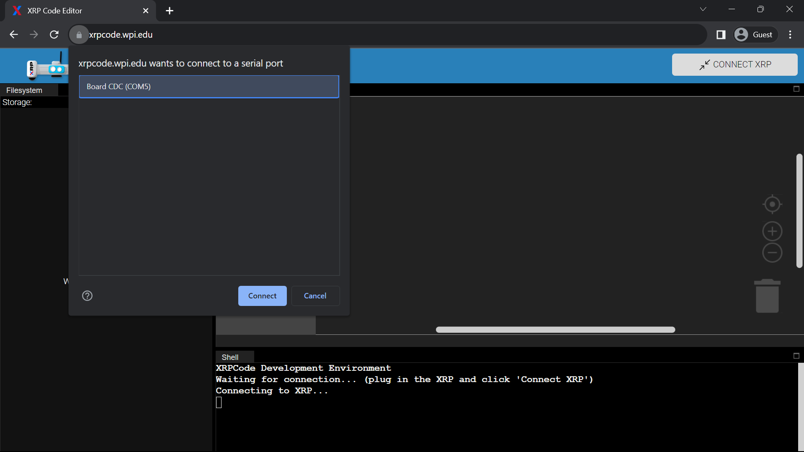
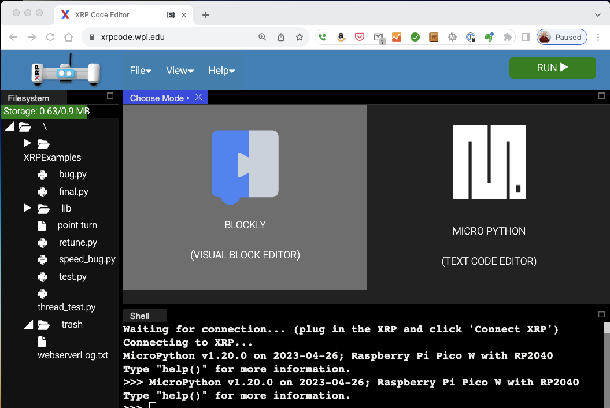
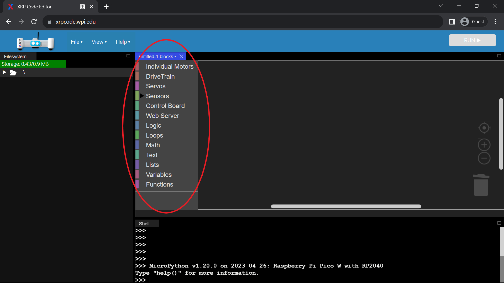
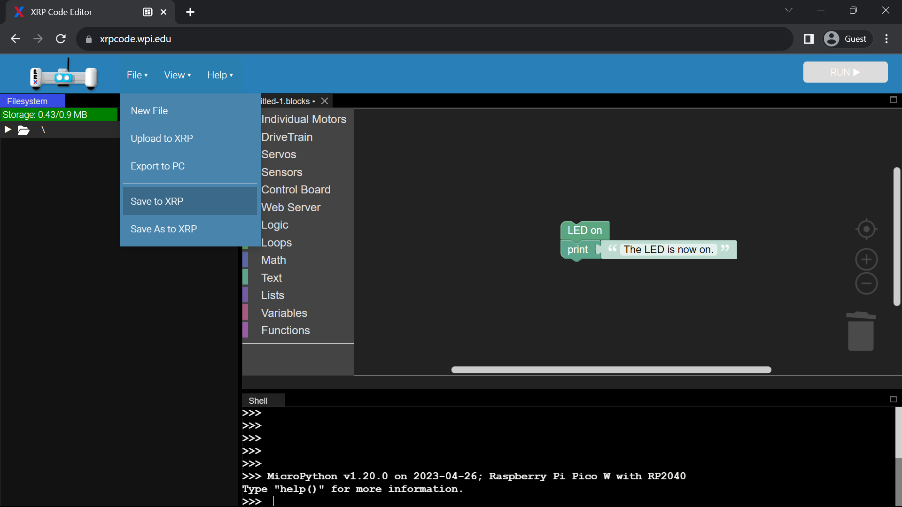
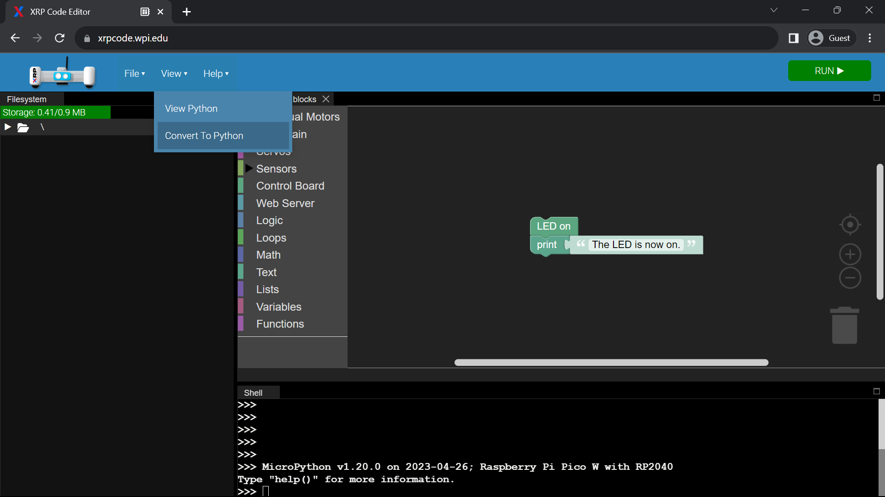
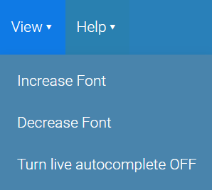

XRPCode Integrated Development Environment
==========================================
XRPCode is a web-based development tool that is run in either the Google Chrome or Microsoft Edge browsers.
XRPCode can be used to create either Python or Blockly language programs that run natively on the XRP
control board. Blockly programs are first translated to Python and then run. In fact, you can view or
even translate the Blockly program into a Python program.

Run XRPCode by navigating to `XRPCode web site <https://xrpcode.wpi.edu>`_. 

If this is your first time accessing XRPCode or if there has been an update, a changelog will be displayed.
Read through the changelog to learn what is new in the current release of XRPLib or the editor.

Exploring the XRPCode user interface
------------------------------------

There are 3 major window areas for XRPCode.

On the left (1) is the Filesystem window. This will show the files on your XRP whenever an XRP is connected. 

In the middle (2) is the editor. This is where you will be working on your programs.

At the bottom (3) is the shell window. This is where print statement output will be displayed. 
You can also use the shell as a command line to write Python code as an interactive way to quickly test ideas.

Connecting your XRP to XRPCode
------------------------------
The XRP robot has a micro USB connector on the controller board that is connected to your computers
USB port with a cable.

.. warning:: 
    Many USB cables are for power only and do not transmit data. You will need a USB cable that can
    transfer data and power. 

Connecting to the XRP
---------------------------
To establish the connection between the XRP robot and the computer, press the 'CONNECT XRP' button. Often the
connection will happen automatically when the XRP is plugged in and XRPCode is started.

This will bring up a dialog that lets you select the computer's serial port that XRPCode will connect to.
In most cases, there will be just one serial device, but if there are more, select the one that is
for your XRP
robot. Click on the CONNECT button after selecting the desired serial port.

When the connection is made, the 'CONNECT XRP' button will change to a green 'RUN' button indicating that
the connection has been made and a program can be run. The Filesystem
window will show the files on the connected XRP.

If XRPCode cannot find your serial connection, or there are other connection issues please refer to
the troubleshooting section at the bottom of this page.

Using XRPCode
-------------
Now that the robot is connected, this is a good time to write a short program to learn about the editor.

In the editor area, there should be a window asking what type of editor to use, either BLOCKLY or MICROPYTHON. (If this is not showing, click on ‘New File’ under the ‘File’ Menu) and select BLOCKLY.

On the left of the editor is a palette
of all the available blocks. 

Notice that they are grouped by functionality. We recommend you click through
each section to get a sense of where blocks are.

In this example, we'll create a program that will turn a controller board LED on and print a message in
the XRPCode shell window a the bottom of the screen.

Click on the "Control Board" tab and then click on the |ico2| block. This will place this block onto your working canvas. You can move the block around and place it where you like. Now click on the "Text" tab. Then select the first block |ico4|. This block is now also on your canvas. You can move this block around and place it right under the |ico2| block. You will notice that as you get close to the bottom of the |ico2| block it will show a yellow line indicating that the two fit together. When you let go of the |ico4| block it should click together with the |ico2| block. Feel free to change the “abc” to say what you want to print; ideally something useful to the program. For example, you might print something like “The LED is now on”.

Save this new program to the XRP. Under the ‘File’ menu select ‘Save to XRP’. 

A dialog will be displayed for you to give this program a name. Change the *untitled* text to a name for your program such as ‘first program’ and click 'OK'. The program has now been saved to the XRP. You will see the name of your program in the Filesystem window on the left. 

You can now press on the green “RUN” button, to run this program. Flip the power switch on your XRP to 'on' and then click ‘OK’. If your XRP is not turned on, a warning will pop up telling you to turn on the power switch.

You will notice a few things:
    * The green LED next to where the USB cable connects to on the XRP will go on for a little while and then turn back off.
    * The shell window at the bottom of XRPCode will print out your message from the print statement.

You may have also noticed that the green ‘RUN’ button changed to a red ‘STOP’ button while your program was running and then turn back after.

Clicking on the ‘STOP’ button will interrupt the program.

You might have noticed that the robot turns off when the program finishes or is interrupted. This is so that at the end of each run, the XRP is reset to a known state in preparation for the next time a program is started.

The ‘View’ menu contents change depending on the language you are using. For Blockly it will show View
options for a Blockly program. Click on ‘View’ and then on ‘View Python’. This will bring up a view of the Python code that is generated from your Blockly file. Let’s actually convert this Blockly program program into a Python program. Click on ‘View’ and then on “Convert to Python”.

XRPCode will first give you a warning to make sure you want to convert the program as this cannot be undone. Click “OK”. It will do the operation and you should notice
two things have happened:

#. There is a new ‘trash’ directory on your XRP.

#. Your program name now ends in .py instead of .blocks. 

If you now go to the ‘View’ menu you will notice that the menu items have changed to be specific to Python. 

Close the 'View' menu and find the print statement in the program; it should be the last line. Change the message that is between the quotes. If you look at the file name tab at the top of the editor you will notice a white dot at the end of the name. That means that this file has been modified and has not yet been saved. Now if you click on the ‘RUN’ button it will save your program and run it again. The message in the shell window should be your new message. 

You can close a file by clicking on the X next to the file name at the top of the editor. If you want to open the program again you can double click on the file name in the Filesystem window.

Congratulations, you have now learned how to create and run programs in XRPCode! 

Troubleshooting XRPCode connection issues
-----------------------------------------
**Cannot see the serial port when connecting**

    * Be sure that the USB cable is a data cable and not just a power cable.

    * Unplug the XRP from the computer and check the connection of the cable on the XRP side.

    * Toggle the power switch on the XRP off. Confirm that the sys LED is on. This means it is properly receiving power from the USB cable. If the LED is not on, try a different cable.

    * Make sure you are running either Google Chrome or Microsoft Edge browsers. At the time of writing,
      only those browsers support serial communication required for programming the XRP.

**XRP was previously used for WPILib or some other purpose**

    * In this case, XRPCode will try to load the current MicroPython firmware onto it; just follow the instructions.

