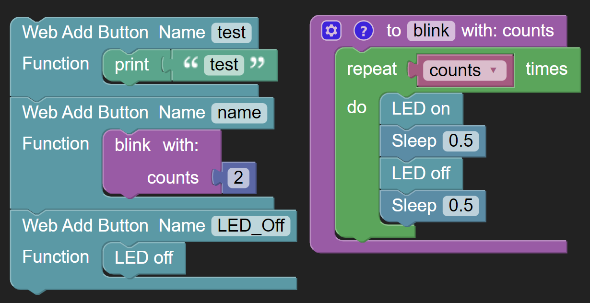
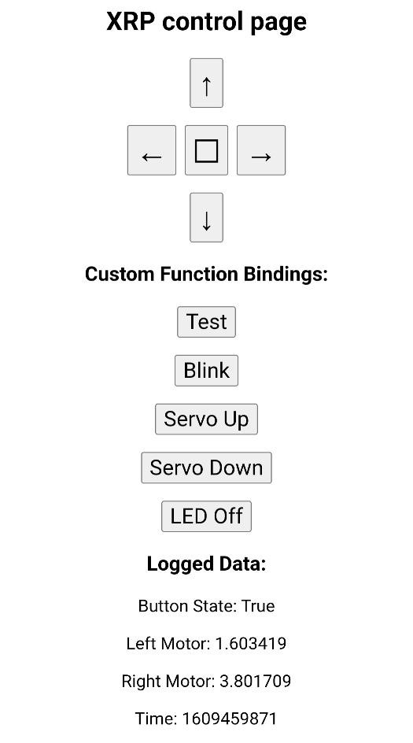

Creating a dashboard
====================
A program can display a web page that can act as a dashboard or
control panel for your robot. The web page can be used for:

1. Program debugging by wirelessly displaying values such as errors, messages
   about what the program is doing, sensor readings, and other status as the robot
   is driving. This allows the XRP to output important values without needing to be plugged in
2. Binding functions to web page buttons so
   that when pressed, the functions are executed by the web server. Using
   this technique, your device can act as a remote controller for your XRP. This is also
   a great technique to test functions as you write them by
   executing them from the web server.
3. To create more graphically pleasing buttons for controlling
   your robot, there are predefined buttons for forward, backward,
   left, right and stop operation. These will
   display on the web page like a game controller dashboard.

Before starting the web server, you should define all the displayed
values, user buttons, and the driver panel.

First, one (but not both) of the following two methods must be called
to initialize the network:

   .. code-block:: python

      start_network(robot_id: int)

   This opens an access point from the XRP board to be used as a captive host.
   The network password is “remote.xrp”

   .. code-block:: python

      connect_to_network(ssid: str, password: str, timeout=10)

   This will connect to a wifi network with the given ssid and password. If the
   connection fails, the board will disconnect from the network and return.

Then, XRPLib will create and start a web server using the robot built-in
WiFi connectivity when the Webserver class method is called:

.. code-block:: python
   
   webserver.start_server(id)

Note that this will only suceed if one (not both) of the above two methods is called first.
This function call will:

1. Bring up the WiFi interface on the robot using a robot number
   parameter to create a unique SSID. When a device (computer, phone,
   or tablet) connects to that SSID from the network settings, it
   will then be on the robot's local network and no longer on the
   internet.
2. Start listening on port 80 (HTTP) for a connection from a
   browser.
3. Dynamically create a web page based on user programming that can 
   have driving controls, buttons corresponding to user functions,
   and display of program data for debugging or robot monitoring.

The user can then connect to the robot web server using a phone,
tablet, or computer to see the web page the robot program creates.

.. note::
   If you connect to the robot to the computer you are using to programming it, you
   might lose connectivity with the internet, so that XRPCode stops
   working.

The user should enter the URL: ROBOT_URL.

Using the web server
--------------------
The start_server() function will never return. Once your program calls
start_server(), the only way of executing code will be through the
generated program. The program will then be event-driven, that is, only
responding to pushbutton events from the web server.

Display running program data
----------------------------
A program can log any expression to the web server as a value by supplying a text label
for the value and the value itself.

Some examples are:

.. code-block:: python

   webserver.log_data("test", "test")
   webserver.log_data("List", [1,2,3])
   webserver.log_data("Dict", {"a":1,"b":2,"c":3})
   webserver.log_data("Tuple", (1,2,3))

Teleop driving from the dashboard
---------------------------------
To drive the robot, a program can create a driving interface by
binding functions to left, right, forward, backward arrow buttons and
a stop button. If bound, these buttons will apear in a diamond
pattern in the browser and will call the bound functions when pressed.

Here is an example of how to do set up those bindings using lambdas
(single line functions) that will operate a robot.

.. code-block:: python

   webserver.registerForwardButton(lambda: drivetrain.set_effort(0.5, 0.5))
   webserver.registerLeftButton(lambda: drivetrain.set_effort(-0.5, 0.5))
   webserver.registerRightButton(lambda: drivetrain.set_effort(0.5, -0.5))
   webserver.registerBackwardButton(lambda: drivetrain.set_effort(-0.5, -0.5))
   webserver.registerStopButton(lambda: drivetrain.set_effort(0, 0))

By using the set_effort function, the robot will continue to drive 
after a single button press until told to do something else.

Calling arbitrary functions from the dashboard
-----------------------------------------------
A program can create a button, that when pressed, will call a user
function to do any operation that is required.

.. code-block:: python

   webserver.add_button("test", lambda: print("test"))
   webserver.add_button("blink", lambda: print(led.blink(2)))
   webserver.add_button("LED_Off", lambda: led.off())

Sample dashboard output
-----------------------
Below is an example of a dashboard that contains data
logging, function buttons, and driving controls. This is
a screen capture from a cell phone web browser where one
can push buttons to run functions or use arrow keys as well
as viewing values from the program.

