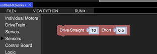
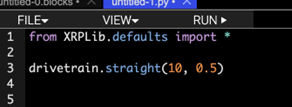
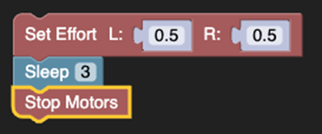
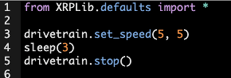
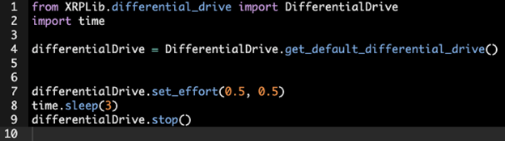
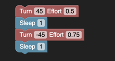
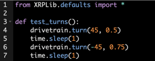

Driving
=======

Robot driving
-------------
The XRP is a mobile robot platform where driving from one place to
another is central to the design of any program. The
differential_drive class makes driving easy and has functions to:

* **Set the motor efforts**, which is the power or average voltage
  applied to the motors. The range of values can be set from -1 for
  full effort in reverse, to 0 for no voltage or stopped,
  to +1 for full effort in the forward direction.

* **Specify a speed to drive** in centimeters per second for each wheel.
  The robot will try to maintain the specified speed as best it can
  using the drive motor encoders.

* **Drive for a specified distance** using the drive motor encoders to
  sense how far the robot has traveled.

* **Make point turns** for a desired number of degrees, either clockwise
  or counterclockwise.

Effort vs. Speed
----------------
Throughout this document, we refer to the effort and speed of the
drivetrain. Although they seem similar, they are distinguished as
follows:

**Effort**
    The effort reflects the amount of power (or average voltage)
    supplied to the motors. For a given effort, the speed will
    vary depending on things like the driving surface, the
    battery voltage, and the slope (either flat, uphill or downhill)

**Speed**
    The speed is the actual number of centimeters per second that
    the robot will travel. When set in a program, the software will
    automatically adjust the motor effort within its capability to
    keep the robot moving at the desired speed.

Driving for a distance
----------------------
The following program fragments show how to program the robot to drive forward for 10 centimeters with an effort of 0.5 or 50 percent power. This function uses the encoders to determine when the robot has traveled the requested 10cm. In addition, this function will ensure that the robot drives in a straight line by varying the speed of the left or right motors if one is slightly faster.

.. note::
  when requesting a distance to drive, the encoders are used to sense the number of degrees of wheel rotation to complete the operation. If the wheels slip while driving, the distance measurement will be incorrect.

Driving with an effort
----------------------
This program will set the effort on the left and right drive motors
to 50 percent, wait for 3 seconds, and stop the motors. The
set_effort() function has parameters for the left and right
drive motors to allow them to be set independently. No motor speed
control is provided, so different driving surfaces, slopes, or
battery voltage will affect the driving speed of the robot.
The value of effort ranges from -1 for 100 percent backward to
0 for no effort or stopped to +1 for 100 percent effort forwards.

Driving at a speed
------------------
This program will set the robot speed to 5 cm per second, in
centimeters per second, of the left and right wheels separately.
If both motors are set to the same speed, the robot will drive
straight. If they are different, the robot will turn in a direction
away from the faster wheel.

Point turns
-----------
The robot can turn in place around a point directly centered between
the two drive wheels. This is done by driving the left and right drive
motors in opposite directions at the same speed. If the left wheel is
spinning in the forward direction, the robot will rotate clockwise
or to the right. If the right wheel is spinning in the forward
direction, the robot will rotate counterclockwise or to the left.

When you use the turn function, the IMU (Inertial Measurement Unit)
gyro sensor on the robot will determine when the robot has completed
the requested turn. This means the turn will continue until complete
and is not affected by wheel slip. 

.. note:: 
    If you were to pick up the robot while it is doing a turn,
    the wheels will continue turning until the gyro senses that the
    robot has turned the desired number of degrees.

Swing turns
-----------
This type of turn is where one wheel moves forward, and the other
is stationary. The robot will pivot on the stationary wheel,
making it the center of rotation. The circle's diameter traveled by
the moving wheel will be twice the wheel track (the distance between
the two wheels).

Smooth turns
------------
Smooth turns are where the two wheels move in the same direction
so that the robot drives in an arc, eventually completing a full
circle. The circle's radius depends on the speed difference between
the two wheels. The larger the difference, the smaller the circle
diameter.
