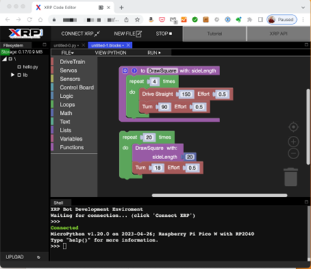

Introduction
============

The XRP (Experiential Robotics Platform) [beta], developed through a collaboration 
between WPI and DEKA Research & Development Corp., aims to level the STEM playing 
field globally and create a future generation of STEM innovators and technology 
leaders.

The robot kits you received are designed to operate autonomously and perform 
basic tasks. Its simple, tool-free assembly means robots can be built quickly, 
and replacement parts can be easily 3-D printed. As part of this platform, 
WPI will provide virtual support through online courses and will guide students 
and teachers through the new system, including the ability to scale up using 
the same hardware with free software updates. 

The XRP platform is part of WPI's global STEM education initiative, 
which will bring inspiration and possibility to STEM education in 
ways that make it available to all. 

Software Tools
==============

There are several software tools available to the programmer for the XRP. Some are available, 
especially for the XRP and other general-purpose tools that may also work with the XRP.

Programming Languages
---------------------

The XRP team supports two programming languages for the XRP:

**Blockly**
    A graphical programming system based on Scratch to make
    it easier to start codingyour robot without the need to
    the syntax of Python. Internally, a Blockly program is
    translated to Python and saved on the robot. Users can
    even see the generated Python code to help them learn to
    use the language themselves.

**Python**
    An object-oriented text-based programming language used throughout
    industry and taught in many classrooms.

Other languages include C and C++. There may be other languages that can also work 
with the RP2040 microprocessor in the XRP.

XRPCode
-------

The recommended programming tool for the XRP is XRPCode. It is a web-based single tool
designed specifically for the XRP to support programming in either Python or Blockly.
It also can check and update firmware and library versions on the robot as new 
software releases become available. XRPCode is a web-based programming system that 
operates inside the Google Chrome browser, so users will always be running the most 
recent version of the tool. 

XRPLib
------
XRPLib is a Python-based programming library that provides classes and functions to make
it easy to use all the features of the XRP Robot. XRPLib is completely open source, 
so users can download the software to see how it works. We also encourage community 
involvement through pull requests to the library. However, we recommend contacting us 
before spending too much time to ensure that your ideas are compatible with our plans 
and development for XRPLib. There are functions to use:

•	The default drive to control speed, direction, and power applied to the two. motors. It can handle driving and turning, with and without sensors such as the IMU, for making accurate point turns.

•	All the sensors on the robot, including the motor encoders, rangefinder, and reflectance sensor. In addition, there are functions to support the IMU (Inertial Measurement Unit) to get the robot heading and accelerations as the robot is driving.

•	The WiFi connection so that programs can create a web server on the robot that can be used to display a dashboard on a connected phone, tablet, or computer. It is designed for displaying program status, driving controls for teleoperation, and buttons to run user functions when pressed for more control of user robot programs.

•	Utility functions for sensing the user buttons, operating the LED, and robot program timing

•	Several small sample programs to help illustrate how the various components are used to operate.

Other tools and languages
-------------------------

In addition to the supplied languages for the robot, users can program the robot using 
other standard tools such as C and C++ using various IDEs like Visual Studio Code. 
VS Code has several plugins specially designed to support Python programming and the 
Raspberry Pi Pico, which is the hardware that powers the XRP.

