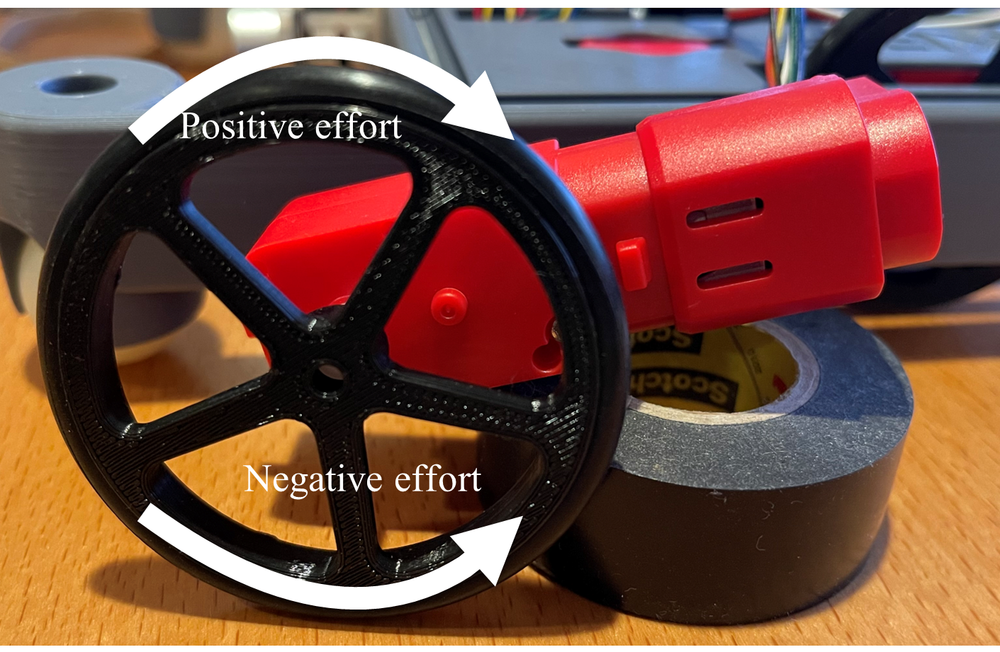
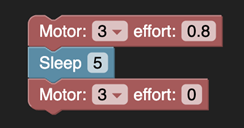
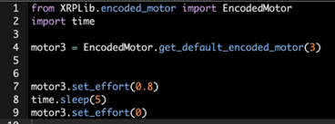

Motors
======
Adding motors
-------------
The XRP has two drive motors connected to the ports Motor L and
Motor R on the robot controller board. The board also supports
two additional motors labeled Motor 3 and Motor 4. These motors
can be used to create additional mechanisms for the XRP.

There are four classes related to motors:

**Motor**
    The motor class handles a single motor with a single method
    for setting the effort between -1 and 1.

**Encoder**
    The encoder class is responsible for measuring the current position
    of a motor. This is useful to derive the speed of the motor, or the
    distance traveled by the motor.

**EncodedMotor**
    Encoded motors contain a motor and an encoder, and has higher
    level logic for functionality that incoporate both objects.
    This class supports features like resetting and getting the motor
    position, setting the effort and speed of the motor, and configuring
    what controller is used for closed-loop speed control.

**MotorGroup**
    It is often desirable to treat several motors as if they
    were one. For example, in a four wheel drive robot, the
    left side motors usually get the same settings when driving
    the robot. A motor_group is created with multiple motors, and
    functionality like setting effort can be applied to all the motors
    in the motor group.

Since the XRP bot is built with an encoder on each motor, it usually
is not necessarily to directly deal with Motor or Encoder objects.
Instead, use EncodedMotor or MotorGroup for higher level functionality.

Using EncodedMotor
------------------
Interacting with EncodedMotor objects is often the most convenient way
to control motors on the XRP. The XRPLib.defaults module provides two
ready-made EncodedMotor objects, left_motor and right_motor, which
allow for fully independent control over the drive motors of the robot.

The EncodedMotor class exposes a few useful methods:

set_effort(effort_value)

The effort value ranges from -1 to +1, where negative efforts spin the
motor in reverse, while positive efforts spin the motor forwards.
An effort of 0 stops the motor.

The programs shown below set Motor 3 to 80 percent effort for 5
seconds, then afterwards, back to 0 percent effort to stop the motor.

Constructing EncodedMotor objects
---------------------------------

There are four motor controllers total on the XRP, numbered 1-4. 
1 and 2 are the left and right motors, and 3 and 4 are labeled
on the robot controller board. left_motor and right_motor objects
are provided by default in the XRPLib.defaults module, but you
construct your own EncodedMotor objects as follows:

    motor = EncodedMotor.get_default_encoded_motor(index=3)

The index parameter specifies which of the four motors (1-4) it is.

In Blockly, constructing motor objects is not necessary. Under the
"Individual Motors" category, each block takes in a parameter to specify
which motor to use.