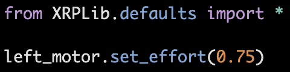
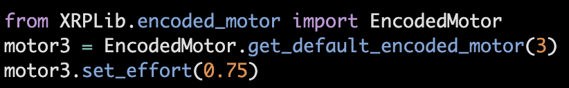
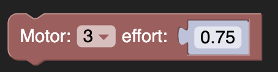
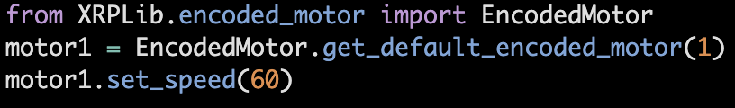
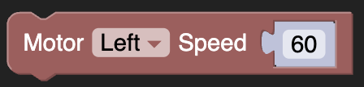
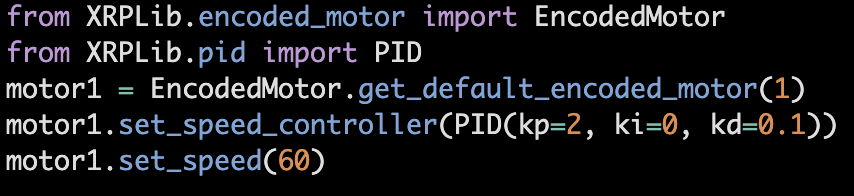

Motors
======
Motor classes
-------------
The XRP has two drive motors connected to the ports Motor L and
Motor R on the robot controller board. The board also supports
two additional motors labeled Motor 3 and Motor 4. These motors
can be used to create additional mechanisms for the XRP.

There are four classes related to motors:

**Motor**
    The motor class handles a single motor with a single method
    for setting the effort between -1 and 1.

**Encoder**
    The encoder class is responsible for measuring the current position
    of a motor. This is useful to derive the speed of the motor, or the
    distance traveled by the motor.

**EncodedMotor**
    Encoded motors contain a motor and an encoder, and has higher
    level logic for functionality that incoporate both objects.
    This class supports features like resetting and getting the motor
    position, setting the effort and speed of the motor, and configuring
    what controller is used for closed-loop speed control.

**MotorGroup**
    It is often desirable to treat several motors as if they
    were one. For example, in a four wheel drive robot, the
    left side motors usually get the same settings when driving
    the robot. A motor_group is created with multiple motors, and
    functionality like setting effort can be applied to all the motors
    in the motor group.

Since the XRP bot is built with an encoder on each motor, it usually
is not necessary to directly deal with Motor or Encoder objects.
Instead, use EncodedMotor or MotorGroup for higher level functionality.

Using EncodedMotor
------------------
Interacting with EncodedMotor objects is often the most convenient way
to control motors on the XRP. The XRPLib.defaults module provides two
ready-made EncodedMotor objects, left_motor and right_motor, which
allow for fully independent control over the drive motors of the robot.

There are four motor controllers total on the XRP, numbered 1-4. 
1 and 2 are the left and right motors, and 3 and 4 are labeled
on the robot controller board. left_motor and right_motor objects
are provided by default in the XRPLib.defaults module. Let's take
a look at how we can use the left_motor object to set the left motor
to an effort of 0.75.

Alternatively, you may also construct your own EncodedMotor objects,
which is needed to control motors 3 and 4. The following code sets
Motor 3 to an effort of 0.75.

In Blockly, constructing motor objects is not necessary. Under the
"Individual Motors" category, each block takes in a parameter to specify
which motor to use. This is all that is needed to set Motor 3 to an effort
of 0.75 in Blockly:

Methods for EncodedMotor objects
--------------------------------

**set_effort(effort_value)**

As seen earlier, this method spins the motor at some raw effort. The
effort value ranges from -1 to +1, where negative efforts spin the
motor in reverse, and positive efforts spin the motor forwards. An
effort of 0 stops the motor.

.. image:: images/Wheel.png
        :width: 300

The programs shown below set Motor 3 to 80 percent effort for 5
seconds, then afterwards, back to 0 percent effort to stop the motor.

.. image:: images/Picture12.png
    :width: 300

.. image:: images/Picture13.png
    :width: 300

**set_speed(speed_rpm)**

The motor attempts to maintain a certain speed in rotations per minute.
It reads from the encoder to determine the current speed, and adjusts
based on a closed-loop controller, which by default is a PID controller.
Similarly to set_effort(), the sign of the speed determines the direction
of the motor.

The example programs below set a speed of 60 rpm for the left motor:

**set_speed_controller(controller)**

The set_speed() function relies on a controller to determine how to vary
the effort of the motor to maintain the specified speed. By default, the
controller is a PID controller, but it can be changed to any object that
implements the Controller abstract class.

The example below sets the speed controller with custom PID tunings. For
more information on controllers, refer to the page under Miscellaneous Topics.
Currently, there is no support for custom controllers in Blockly.

**get_speed() -> float**

Returns the current speed of the motor in rotations per minute, as measured
by the encoder.

**get_position() -> float**

Returns the current position of the motor in rotations, as measured by the
encoder.

**reset_encoder_position()**

Resets the encoder position to 0. get_position() returns the difference in
position since the last reset.