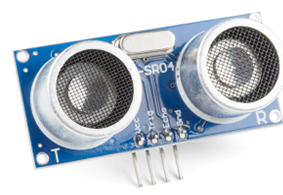
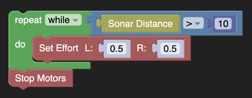
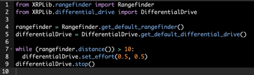
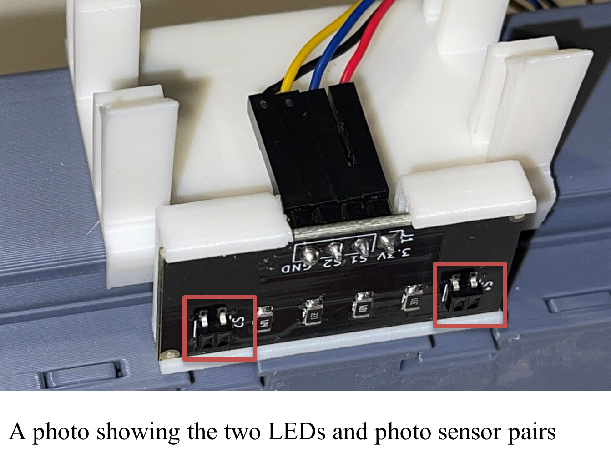
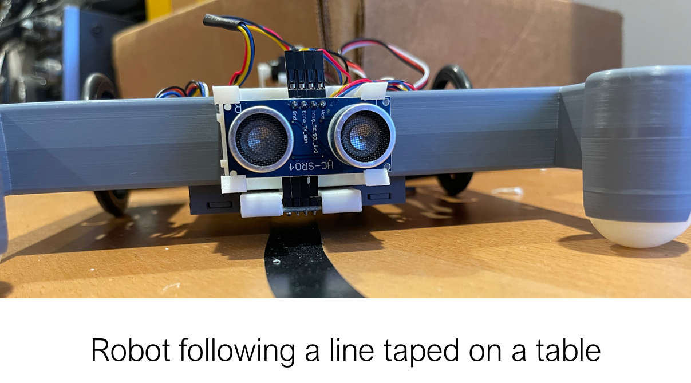
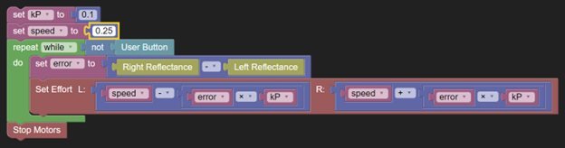

Sensing the environment
=======================

Measuring the distance to an object
-----------------------------------
The XRP includes an ultrasonic rangefinder that can measure the
distance to objects in front of it.  The sensor has two transducers;
one acts as a speaker, and the other acts as a microphone. It does
it by sending a burst of ultrasonic sound out of the speaker that
hits an object in front of the robot. The sound reflects off the
object back to the sensor and is captured by the microphone. The
time for that round trip determines the distance to the object.
Understanding how well the sound reflects off various objects of
different sizes, profiles, and materials is important for using
the sensor. A good exercise is to test the sensor by printing
returned values at various distances from any object you want the
robot to detect.

.. note::
    It is important to wire the sensor correctly, as described in
    the assembly instructions, to ensure it works properly.
    Interchanging the trigger and echo wires is a common
    error using that part.

XRPLib has a rangefinder class that takes care of the sending and
receiving signals to the sensor. All the program has to do is request
the distance, and the library returns it. There is a single method
called distance() that returns the distance to the nearest object
in centimeters. The range of operation is from 2cm to 4m.

Example use of the rangefinder
-------------------------------
The following program drives the XRP forwards until the code
detects an object within 10cm of the ultrasonic rangefinder.
Then it stops.  

This program stops the motors when the object is detected. A
better way of solving the same problem might be to use proportional
or PID control to gradually bring the robot to a stop to avoid
overshoot, where inertia might carry the robot beyond the 10cm
set point before it comes to rest.

Following lines
---------------
A reflectance sensor that can be used for line following is included
with the XRP. It has two pairs of LEDs and light sensors. The LEDs
emit infrared light that reflects off the driving surface. The light
sensor measure the reflected light intensity, which depends on the
surface below the sensor. Electrical tape is typically used to make
a line that the robot can follow and has a different reflectivity
than the surface, usually a whiteboard or tabletop. With a pair of
sensors, the robot can read the reflectance value and tell where it
is relative to the taped line.

The class reflectance has methods get_right() to retrieve the
right reflectance value and get_left() to retrieve the left
reflectance value.

Line following example program
------------------------------
The following program uses proportional control with the line
sensors to follow a line across the driving surface for the robot.
The Kp variable sets the gain for the controller.

